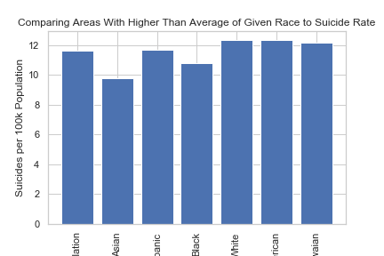
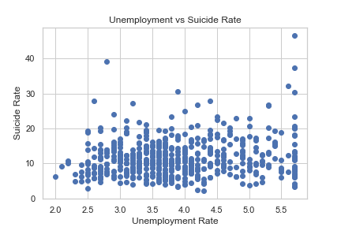

# **Suicide Rate By County Investigation**

### <b>A model to help direct resources where they can be most useful.</b>

According to americashealthrankings.org there were 47,000 deaths from suicide in 2017, making it the 10th leading cause of death in the United States. As opposed to the other 9 causes of death on the list though, suicides are 100% preventable.

Many effective interventions have been created to avert would be suicides, and thus, uncovering any foreknowledge of those at risk would help to direct attention to the right place and save lives.

In an effort to gain understanding on the situation I aggregated suicide deaths in the U.S. as well as many demographic characteristics at a county level for the year 2018, and then created a model with the goal of understanding what factors most closely relate to suicide deaths.

# Data Sourcing

### <b>Suicide Deaths:</b>

I collected suicide data from the CDC's <em>Underlying Cause of Death</em> database.

To source this data:

<ul>
<li>Visit https://wonder.cdc.gov/ucd-icd10.html and accept the terms and conditions</li>
<li>In the "1. Organize table layout" section, group results by "County" and by "Cause of death"</li>
<li>In the "4. Select year..." section, select 2018</li>
<li>In the "6. Select cause of death" section, click the "Search" tab and inpute "suicide". Then, select all of the options highlighted</li>
<li>Lastly, in the "7. Other options" section, select "Export Results" and then click "send".</li>
<li>Your csv file should be downloaded</li>
</ul>

### <b>Unemployment Rate:</b>

I collected unemployment rates by county from the U.S. Bureau of Labor Statistics.

The data is downloadable at https://www.bls.gov/lau/#cntyaa and can be found next to "Labor force data by county, 2018" under the "COUNTY DATA" section.

### <b>Demographic Information:</b>

Demographic information was provided by the County Health Rankings & Roadmaps program, a collaboration between the Robert Wood Johnson Foundation and the University of Wisconsin Population Health Institute.

The data is downloadable at https://www.countyhealthrankings.org/explore-health-rankings/rankings-data-documentation. It can by found in the "2018 County Health Rankings" section and downloaded by clicking on "2018 CHR CSV Analytic Data".

# Data Cleaning, Feature Selection, and Feature Engineering:

From the suicide and unemployment data the selection is easy - take the number of suices and unemployment rate, each organized by county. Because suicide has multiple "cause of death codes" the dataframe does need to be grouped by county and the deaths summed.

Both of these data frames can then be merged with the demographic data.

Sorting through demographic data is not so easy though, as there are over 500 variables to work with. After several passes through narrowing down the variables to those that seem the most practical, I began cleaning the data by further eliminating columns with more than 100 NA values. NA values in columns with less than 100 NA values were filled with that column's median value.

I went through many iterations comparing the correlation of each independant variable with my target variable and realized my target variable was wrong. Because counties vary widely in population, I needed to convert by target variable to represent a rate related to the population.

With the right target variable I experimented again, looking at correlation matrixes, using f tests to select the 15 (and sometimes 30) best variables, and looking at the variance inflation factors.

The data was overwhelming, the dictionary was useless, and the descriptions were very hard to find. Thus in an effort to be accurate without misinterpreting the data that was collected, I focused my attention on measuring more broad differences, creating categorical variables to show where characteristics were exceptional.

This resulted in engineering varaibles to segment the observations by race, including:

<ul>
<li>above_average_female_population</li>
<li>above_average_white_population</li>
<li>above_average_black_population</li>
<li>above_average_hispanic_population</li>
<li>above_average_asian_population</li>
<li>above_average_native_population</li>
<li>above_average_native_HI_population</li>
</ul>
As well as other characteristics including:
<ul>
<li>above_average_rural_population</li>
<li>above_average_elderly_population</li>
<li>above_average_child_population</li
></ul>
We also retain our unemployment_rate variable from before.

# Analysis:

### **Segmenting by Race:**

By plotting the suicide rate for each population alongside the average for the whole, you can see that they are not uniform, and the results look promising.

Before we get too excited though, we need to test for statistical significance.

After running T tests with each population we find that only the Asian subcategory is statistically significant.

### **Unemployment Rate:**

The correlation between unemployment rate and suicide rate is 0.146. We can see from a scatter plot that this is not very strong, however, it is statistically significant and thus can explain some of the relationship

### **Sex:**

Areas with a higher proportion of females in the population appear to have lower suicide rates, however, by conducting a T test we fail to reject the null hypothesis that the averages are, in fact, the same. Thus, we can not rely on this for our model.

### **Age:**

### Older Populations:

From the percent of the population over the age of 65 we created the category of above average elderly population (sorry if you're older than 65 and take offense to being called elderly).

On average, counties with higher than average elderly populations had just over 20% more more suicides than those with below average proportions of elderly populations.

From a T test we can also see that this difference is statistically significant

### Younger Populations:

From the percent of population younger than 18 we created the category of above average child population. There was almost no difference between this segment and it's compliment though, nor was the small difference statistically significant.

### **Rural Populations:**

Looking at suicide rates for above average rural populations vs below average gives us one of our most striking differences = the suicide rate for above average rural populations is almost 30% that of its compliment. As well, this observation was statistically significant.

# Conclusion:

From this analysis we found 4 factors that can influence the rate of suicide in a county:

<ul>
<li>Rural population</li>
<li>Elderly population</li>
<li>Unemployment rate</li>
<li>Asian population</li>
</ul>

We can utilize this information to minimize the rates of suicides by providing extended support to people in rural settings, reaching out to elderly populations with support materials, and paying attention when people become unemployed.

As well, while we can't give every county a higher than average proportion of Asian population, we can learn from Asian communities and explore further why they have lower suicide rates.
